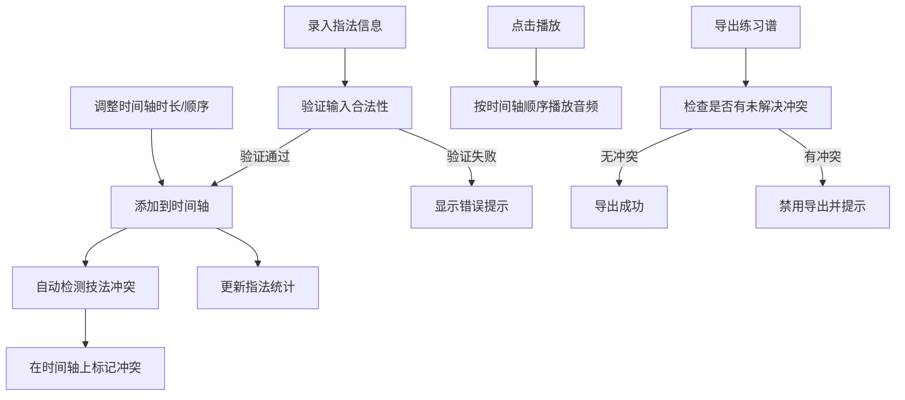

## 1. 产品概述

古琴减字谱指法时间轴编辑器，帮助古琴学习者和演奏者将减字谱片段整理为可播放、可标注的数字化指法时间轴。用户可以录入谱字、弦位、徽位、左右手技法，在时间轴上调整时长，预览音频播放效果，并检测技法冲突。

### 核心价值
- 将传统减字谱转化为可视化时间轴，便于理解和学习
- 提供音频预览功能，辅助听觉记忆
- 自动检测技法冲突，确保指法合理性
- 统计指法频次，帮助针对性练习

## 2. 核心功能

### 2.1 功能模块

1. **指法录入模块**：录入谱字、弦位、徽位、右手指法、左手技法、持续时长
2. **时间轴编辑模块**：可视化展示所有指法，支持拖拽调整时长和顺序
3. **音频播放模块**：根据指法生成简化音频预览，按时间轴顺序播放
4. **技法冲突检测模块**：自动检测同一时间点冲突的左右手技法并标记
5. **指法统计模块**：统计一段谱中不同指法的出现频次
6. **导出模块**：导出练习谱（需先解决所有技法冲突）

### 2.2 功能详情

| 页面名称 | 模块名称 | 功能描述 |
|---------|---------|---------|
| 主页面 | 指法录入表单 | 录入谱字（必填）、弦位（1-7弦）、徽位（合法范围校验）、右手指法、左手技法、持续时长（>0） |
| 主页面 | 指法列表 | 展示所有录入的指法，支持编辑和删除 |
| 主页面 | 时间轴编辑器 | 横向时间轴展示，支持拖拽调整每个指法的持续时长，调整后播放顺序自动同步 |
| 主页面 | 播放控制 | 播放/暂停/停止，当前播放位置指示 |
| 主页面 | 冲突标记 | 在时间轴上高亮标记存在技法冲突的指法 |
| 主页面 | 指法统计面板 | 展示不同右手指法和左手技法的出现频次统计 |
| 主页面 | 导出功能 | 导出练习谱为 JSON 格式，存在未解决冲突时禁用导出 |

## 3. 核心流程

### 用户操作流程
用户录入指法信息 → 系统验证输入合法性 → 指法添加到时间轴 → 用户可调整时长和顺序 → 系统自动检测技法冲突 → 用户播放预览音频 → 用户查看指法统计 → 无冲突时可导出练习谱

### 核心业务规则
1. 谱字不能为空
2. 持续时长必须大于 0
3. 同一时间点不能出现互相冲突的左右手技法
4. 徽位范围需要合法（一徽至十三徽及中间徽位）
5. 调整时间轴后播放顺序必须同步更新
6. 未解决技法冲突时不能导出练习谱

## 4. 用户界面设计

### 4.1 设计风格
- **主色调**：深褐色系（#3E2723 深棕），体现古琴的传统文化底蕴
- **辅助色**：金色（#FFB74D）用于高亮和强调，米白色（#F5F0E8）背景
- **风格定位**：雅致古典风格，融合现代 UI 交互
- **字体**：标题使用衬线字体，正文使用清晰易读的无衬线字体
- **按钮样式**：圆角按钮，悬停时有微妙的阴影和色彩变化
- **图标风格**：线性图标，简洁优雅

### 4.2 页面布局
- 顶部：标题栏和操作按钮（播放控制、导出）
- 左侧：指法录入表单
- 中间主体：时间轴编辑器
- 右侧：指法统计面板
- 底部：指法列表详情

### 4.3 响应式设计
- 桌面端：三栏布局（左表单 + 中时间轴 + 右统计）
- 平板端：两栏布局，统计面板折叠
- 移动端：单栏垂直布局，支持横向滚动时间轴

### 4.4 动效设计
- 时间轴指法块支持拖拽时的实时反馈
- 播放时当前位置指示器平滑移动
- 添加/删除指法时有淡入淡出过渡
- 冲突标记有呼吸闪烁效果吸引注意
