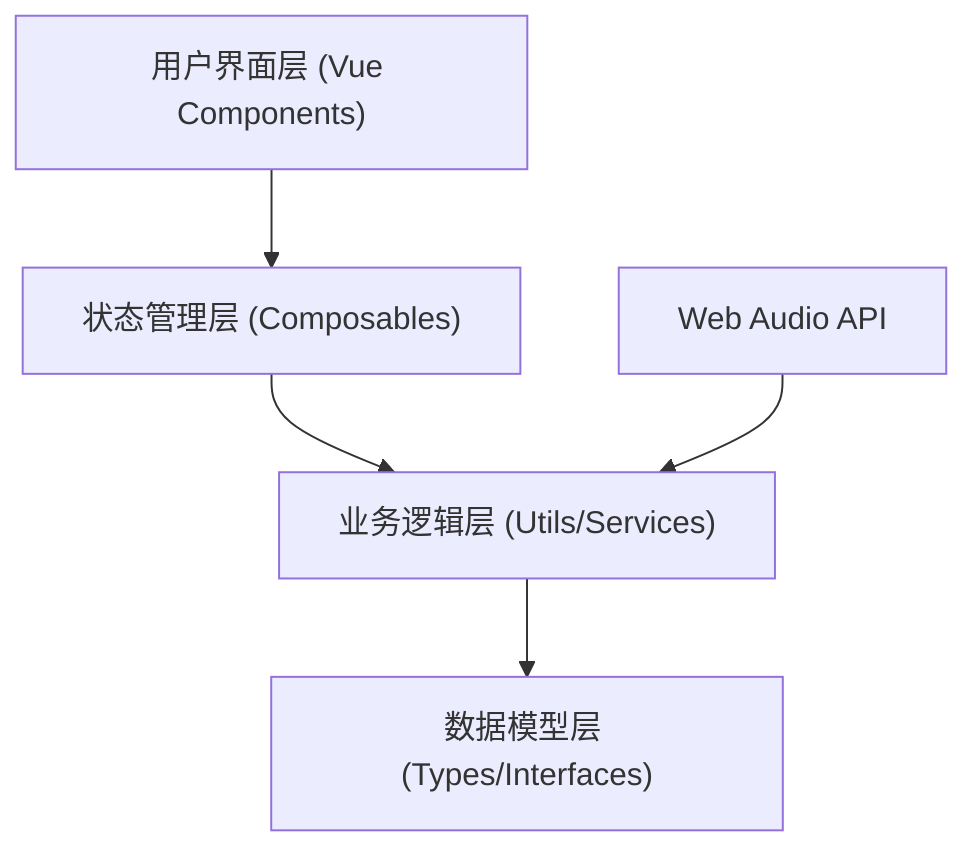
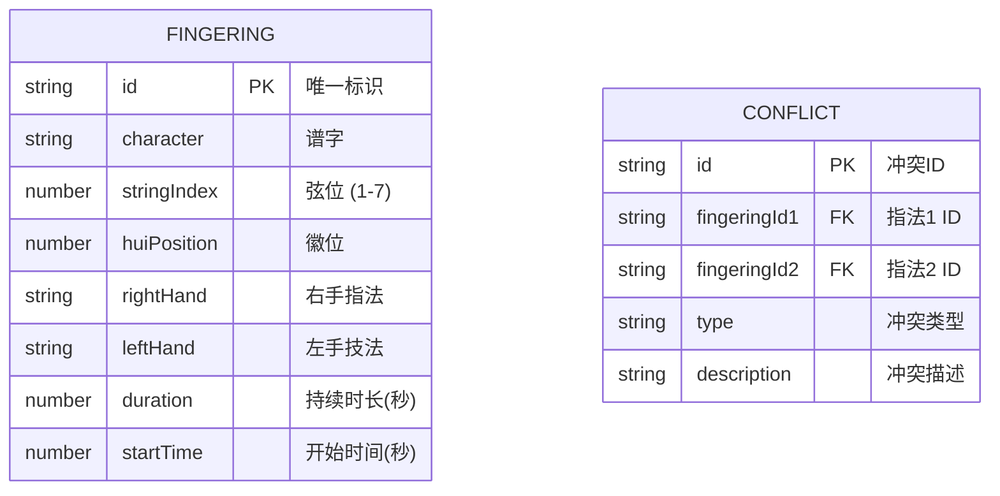

## 1. 架构设计

本项目为纯前端 Vue3 单页应用，使用浏览器 Web Audio API 实现音频播放，所有数据存储在前端内存中。



## 2. 技术描述

- **前端框架**：Vue 3 + TypeScript + Vite
- **样式方案**：Tailwind CSS 3
- **状态管理**：Vue Composition API + Composables
- **音频播放**：Web Audio API（浏览器原生）
- **图标**：Lucide Icons
- **构建工具**：Vite 5

## 3. 项目结构

```
src/
├── components/          # 组件目录
│   ├── FingeringForm.vue       # 指法录入表单
│   ├── TimelineEditor.vue      # 时间轴编辑器
│   ├── TimelineItem.vue        # 时间轴单个指法项
│   ├── PlayerControls.vue      # 播放控制器
│   ├── StatsPanel.vue          # 统计面板
│   └── FingeringList.vue       # 指法列表
├── composables/         # 组合式函数
│   ├── useFingeringStore.ts    # 指法状态管理
│   ├── useAudioPlayer.ts       # 音频播放器
│   └── useConflictDetector.ts  # 冲突检测
├── types/               # 类型定义
│   └── fingering.ts            # 指法相关类型
├── utils/               # 工具函数
│   ├── validation.ts           # 验证函数
│   └── audio.ts                # 音频工具
├── App.vue              # 根组件
└── main.ts              # 入口文件
```

## 4. 数据模型

### 4.1 数据模型定义



### 4.2 核心类型定义

```typescript
// 右手指法
type RightHandTechnique = 'tuo' | 'pi' | 'mo' | 'tao' | 'gou' | 'ti' | 'da' | 'zhai' | 'bo' | 'fu' | 'lun' | 'cuo' | 'zhuang' | 'ling' | 'ren';

// 左手技法
type LeftHandTechnique = 'none' | 'tao' | 'ni' | 'fuo' | 'zhuang' | 'xian' | 'zhu' | 'chi' | 'chang' | 'duan' | 'shang' | 'xia' | 'jin' | 'tui' | 'fu';

// 指法数据
interface Fingering {
  id: string;
  character: string;        // 谱字（减字谱字符名称）
  stringIndex: number;      // 弦位 1-7
  huiPosition: number;      // 徽位 1-13，支持 0.5 表示半徽
  rightHand: RightHandTechnique; // 右手指法
  leftHand: LeftHandTechnique;   // 左手技法
  duration: number;         // 持续时长（秒）
  startTime: number;        // 开始时间（秒）
}

// 技法冲突
interface Conflict {
  id: string;
  fingeringIds: string[];
  type: 'left_hand' | 'right_hand' | 'timing';
  description: string;
}

// 指法统计
interface FingeringStats {
  rightHand: Record<RightHandTechnique, number>;
  leftHand: Record<LeftHandTechnique, number>;
  total: number;
}
```

## 5. 核心模块说明

### 5.1 验证模块
- 谱字非空校验
- 弦位范围校验（1-7）
- 徽位合法范围校验（0-13.5，支持半徽）
- 持续时长校验（> 0）
- 技法冲突校验（同一时间点左右手技法是否冲突）

### 5.2 冲突检测模块
- 时间重叠检测：检查指法时间区间是否重叠
- 左右手冲突规则：定义哪些技法不能同时存在
- 冲突标记：在时间轴上高亮显示冲突指法

### 5.3 音频播放模块
- 使用 Web Audio API 的 OscillatorNode 生成简化音色
- 根据弦位和徽位计算音高
- 按时间轴顺序依次播放
- 支持播放、暂停、停止控制

### 5.4 时间轴编辑模块
- 可视化展示所有指法的时间分布
- 支持拖拽调整指法的持续时长
- 支持拖拽调整指法的开始时间
- 实时更新播放顺序
